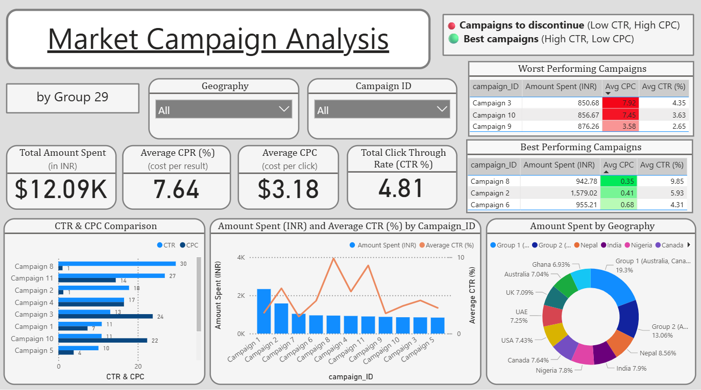
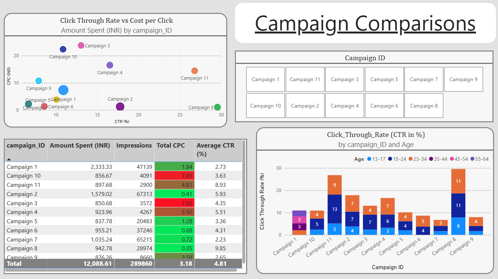
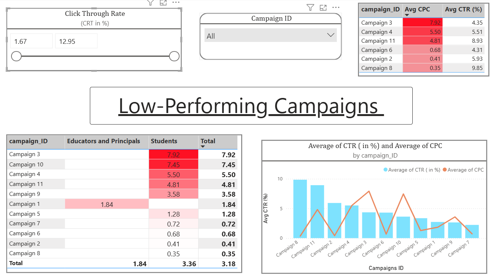

# 📊 Excelerate Campaign Analysis Dashboard

This Power BI dashboard provides a comprehensive analysis of digital ad campaign performance for Excelerate, focusing on key metrics such as reach, engagement, conversion rates, and return on ad spend (ROAS).

---

## 🎯 Objective

To help Excelerate’s marketing and analytics teams:
- Understand campaign effectiveness
- Identify high- and low-performing channels
- Optimize ad spend based on insights
- Track KPIs in real-time

---

---

## 📌 Key Metrics Tracked

- **Impressions**
- **Click-Through Rate (CTR)**
- **Cost per Click (CPC)**
- **Conversion Rate**
- **Cost per Conversion**
- **Return on Ad Spend (ROAS)**
- **Channel Performance (Google, Meta, etc.)**

---

## 📊 Dashboard Features

- 📈 **Dynamic filtering** by platform, time period, and campaign
- 🧭 **Interactive visualizations** for easy exploration
- 💡 **Insight panels** highlighting key takeaways
- 🧮 Built-in **DAX calculations** for KPI metrics

---

## 🛠 How to Use

1. Open the `.pbix` file in **Power BI Desktop**
2. Use slicers to filter by:
   - Ad platform 
   - Date range
   - Campaign name
3. Explore the visualizations and insights provided

---

## 🔍 Insights Example (Sample Highlights)

---

## 📦 Requirements

- [Power BI Desktop](https://powerbi.microsoft.com/desktop/)

---

